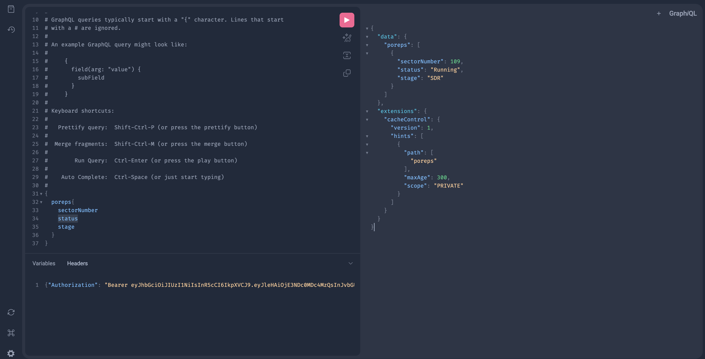

# Curio Dashboard

[](https://github.com/web3tea/curio-dashboard/actions) [](https://goreportcard.com/report/github.com/web3tea/curio-dashboard) [](https://www.codefactor.io/repository/github/web3tea/curio-dashboard) [](https://github.com/web3tea/curio-dashboard/releases)

## Overview

`Curio Dashboard` is a web-based interface designed for monitoring and managing your [Curio](https://github.com/filecoin-project/curio) cluster. It provides an intuitive layout with real-time metrics and rich visualizations, allowing you to efficiently oversee cluster activity and data insights.

|  |  |
|:--------------------------------:|:------------------------------:|
|  |  |
### Key Features

- **Authenticated Access**: Secure login ensures data protection with role-based access control.
- **Role-Based Permissions**: Built-in permission levels (Admin, Operator, User) for granular access control.
- **Efficient Data Management**: Server-side pagination and filtering for handling large datasets.
- **Responsive UI**: Dark/light mode support and responsive layout design for different screen sizes.
- **Real-Time Monitoring**: Live data streaming for real-time insights.
- **Data Visualizations**: Detailed charts to analyze cluster performance and trends.

## Architecture Diagram
```mermaid
flowchart TD
    subgraph Frontend
        UI["Dashboard UI (Vue.js)"]
    end

    subgraph Backend
        App["Backend (Go)"]
        Config["Config"]
        GraphQL["GraphQL API"]
        DB["Database Connector"]
        Helper["Helpers"]
    end

    subgraph External
        Curio["Curio Node API"]
        YB["YugabyteDB"]
        Prom["Prometheus"]
        Exporter["Curio Exporter"]
        Lotus["Lotus Daemon"]
    end

    subgraph Deploy
        CICD["CI/CD & Container"]
    end

    UI --> GraphQL
    Config --> App
    App --> GraphQL
    App --> DB
    App --> Helper
    GraphQL --> Curio
    GraphQL --> Prom
    DB --> YB
    App --> Lotus
    Curio --> Prom
    Exporter --> YB
    Exporter --> Prom
    CICD --> App
```

## Requirements

- **Curio Node**: A reachable Curio Web API, e.g., `http://localhost:4701`.
- **YugabyteDB**: Distributed database used by the Curio cluster.
- **Prometheus**: Collects metrics from the Curio cluster for monitoring. (Optional)
- **Lotus Daemon Node**: Required for blockchain data retrieval.

## Usage

### Docker

```bash
# Pull the latest Docker image
docker pull ghcr.io/web3tea/curio-dashboard:latest  # Use the latest release
# docker pull ghcr.io/web3tea/curio-dashboard:main # Use the main branch

# Generate the default configuration file
docker run --rm ghcr.io/web3tea/curio-dashboard:latest config default > config.toml

# Edit the configuration file
# vim config.toml # or use your preferred text editor

# Run the dashboard
docker run -d \
  -p 9091:9091 \
  --restart unless-stopped \
  -v "$(pwd)"/config.toml:/config.toml:ro \
  ghcr.io/web3tea/curio-dashboard:latest --debug run
```

### Pre-built Binaries

Visit the [Releases](https://github.com/web3tea/curio-dashboard/releases) page to download the latest binaries.

After downloading the correct binary for your platform and architecture, follow the [Running the Dashboard](#running-the-dashboard) instructions below.

### Building From Source

Follow these steps to build the dashboard from source:

1. **Install System Dependencies**
   Follow the [Curio Storage Installation Guide](https://docs.curiostorage.org/installation#linux-build-from-source).
   You’ll also need Node.js and pnpm for the frontend.
   * [Node.js >= 22](https://nodejs.org/en/download/)
   * [pnpm >= 10.0.0](https://pnpm.io/installation)

2. **Clone the Repository**
   ```bash
   git clone https://github.com/web3tea/curio-dashboard.git
   ```

3. **Build the Project**
   ```bash
   cd curio-dashboard
   make
   ```

## Running the Dashboard

1. **Generate Default Configuration**
   ```bash
   ./curio-dashboard config default > config.toml
   ```

2. **Edit the Configuration**
   Adjust the `config.toml` to match your setup, including user roles and permissions, or start with a [minimal configuration file](minimal.config.toml).

3. **Start the Backend**
   ```bash
   ./curio-dashboard --debug run
   ```

4. **Access the Dashboard**
   - Production URL: [http://localhost:9091](http://localhost:9091)
   - Development URL: [http://localhost:3000](http://localhost:3000) (`cd ui; pnpm dev`)

## User Authentication and Role Permissions

The Curio Dashboard implements a role-based access control system with three permission levels:

- **Admin**: Full system access with all privileges
- **Operator**: Operational access for monitoring and management tasks
- **User**: Basic read-only access for viewing dashboard data

Configure users and their roles in the `config.toml` file:

```toml
[auth]
secret = "your-jwt-secret"
expires = 24  # Token expiration in hours

[[auth.users]]
username = "admin"
password = "strong-password"
role = "admin"
description = "Administrator account"

[[auth.users]]
username = "operator"
password = "secure-password"
role = "operator"
description = "Operations account"

[[auth.users]]
username = "user"
password = "user-password"
role = "user"
description = "Read-only account"
```

## GraphQL Playground

GraphQL Playground is a graphical, interactive, in-browser GraphQL IDE that allows you to explore and test the GraphQL API.

### Accessing GraphQL Playground

1. **Without Authentication**
   - If authentication is disabled (no JWT secret configured), you can directly access the playground at:
     - [http://localhost:9091/playground](http://localhost:9091/playground)

2. **With Authentication**
   - If authentication is enabled, you will need a valid token:
     ```bash
     ./curio-dashboard auth gt --user admin
     ```
   - In the playground interface, add a header with your token:
     ```json
     {
       "Authorization": "Bearer <your_token>"
     }
     ```
   - This token will allow you to execute authenticated GraphQL operations in the playground


